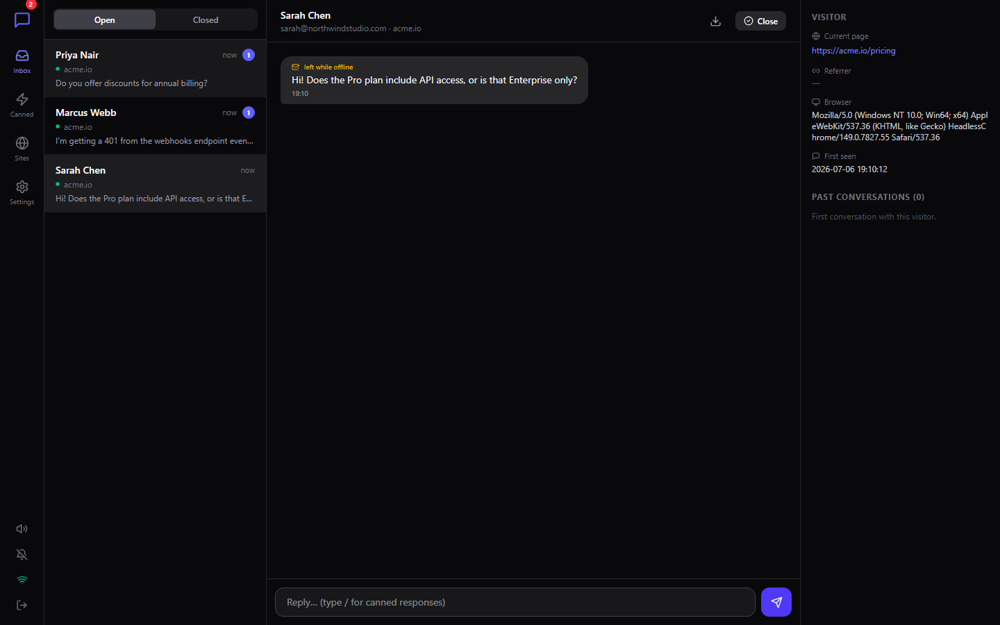

# 💬 Chatlet — Self-Hosted Live Chat for Your Website


**Pay once. Own it forever. No subscription.**

Chatlet is the live chat widget you drop on any website — the same "chat bubble in the corner" you'd pay Crisp, Intercom, or Tawk.to for every month — except you host it, you own the data, and there's no per-seat pricing, no branding removal fee, and no monthly bill. One tiny Node server, one SQLite file, unlimited sites, unlimited agents, unlimited conversations.



## ✨ Features

- **One-line embed** — `<script src="https://your-server/chat.js" data-site="ID"></script>`. Shadow-DOM widget, so your site's CSS can't break it (and vice versa).
- **Real-time over WebSockets** — with automatic reconnect, an outgoing message queue, and a transparent HTTP-polling fallback when corporate firewalls block WS.
- **Agent dashboard** — live-updating conversation inbox (open/closed, unread badges), chat view, typing indicators both ways, sound + browser notifications.
- **Visitor context sidebar** — see the visitor's current page, referrer, browser, and their full past-conversation history while you chat.
- **Canned responses** — type `/shortcut` in the composer to fire off saved replies instantly. Full CRUD in the dashboard.
- **Offline mode** — no agent online? The widget switches to "leave a message", stores it flagged in your inbox, and (optionally) emails you via your own SMTP.
- **Multiple sites** — one Chatlet install powers chat on every site you run, each with its own embed snippet.
- **Transcripts** — download any conversation as a text file.
- **Visitor identity** — optional name/email prompt; visitor ID persists in localStorage so returning visitors keep their history.
- **100% local & private** — SQLite storage, zero telemetry, zero third-party calls.

## 🚀 Quick start

```bash
npm i && npm run build && npm start
```

- Dashboard: `http://localhost:5314/admin/` (default password `admin` — change it!)
- Go to **Sites**, copy your embed snippet, paste it before `</body>` on your website. Done.

## 🖥️ Two ways to run it

**Desktop app (zero setup):**

```bash
npm run desktop
```

Opens the agent dashboard as a native window, auto-logged-in, with the chat server running inside it. Run it all day like Slack. (`npm run dist` builds a Windows installer.)

> Note: for visitors on the public internet to reach your chat, the server needs a public address — desktop mode is perfect for local/LAN use, testing, and as the always-on agent console pointed at your own machine via a tunnel.

**VPS (public, $5/mo hosting at most):**

```bash
docker compose up -d
# or: npm i && npm run build && PORT=5314 ADMIN_PASSWORD=strong-pw npm start
```

Put it behind your reverse proxy with TLS (Caddy/Traefik/nginx — make sure WebSocket upgrade is passed through) and embed the snippet anywhere.

## ⚙️ Configuration

Copy `.env.example` to `.env`:

| Variable | Default | Purpose |
|---|---|---|
| `PORT` | `5314` | Server port |
| `ADMIN_PASSWORD` | `admin` | Dashboard login |
| `DATA_DIR` | `./data` | SQLite database location |
| `SMTP_HOST/PORT/USER/PASS/FROM`, `NOTIFY_EMAIL` | — | Optional offline-message email notify (also settable in dashboard Settings) |

## 🥊 Chatlet vs. the monthly guys

| | **Chatlet** | Crisp | Intercom | Tawk.to |
|---|---|---|---|---|
| Price | **$49 once** | $95/mo (Plus, team) | ~$39+/seat/mo | "Free" (pay $228/yr to remove branding) |
| Your data on your server | ✅ | ❌ | ❌ | ❌ |
| Unlimited agents | ✅ | Per-plan limits | Per-seat pricing | ✅ |
| Unlimited sites | ✅ | Per-plan limits | ❌ | ✅ |
| Remove branding | ✅ (there is none) | Paid | Paid | $228/yr |
| Canned responses | ✅ | Paid tier | ✅ | ✅ |
| Offline messages + email notify | ✅ (BYO SMTP) | ✅ | ✅ | ✅ |
| Works forever without a vendor | ✅ | ❌ | ❌ | ❌ |

Crisp's team plan is **$95/month = $1,140/year**. Chatlet pays for itself in under 3 weeks.

## ☕ Skip the setup — get the 1-click installer

Don't want to touch a terminal? Grab the packaged installer (Windows desktop app + one-command VPS deploy) — [**Get Chatlet on Whop →**](https://whop.com/onetime-suite)

## 🧪 Testing

```bash
npm test
```

Spins up the real server and drives real visitor + agent WebSocket clients through 12 end-to-end checks: live delivery both directions, typing relay, reconnect history, offline flagging, polling fallback, canned CRUD, and auth rejection.

## 🛠️ Tech stack

- **Server:** Node 20+, Express, `ws`, better-sqlite3 (WAL), nodemailer (optional SMTP)
- **Dashboard:** React 18, Vite, Tailwind CSS 4, Framer Motion, Lucide icons
- **Widget:** dependency-free vanilla JS in a shadow DOM (~9 KB served)
- **Desktop:** Electron wrapper around the same server, electron-builder NSIS config

## License

MIT © 2026 Ben (bensblueprints)
